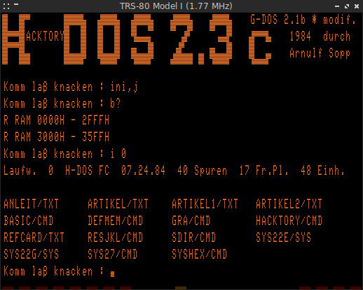
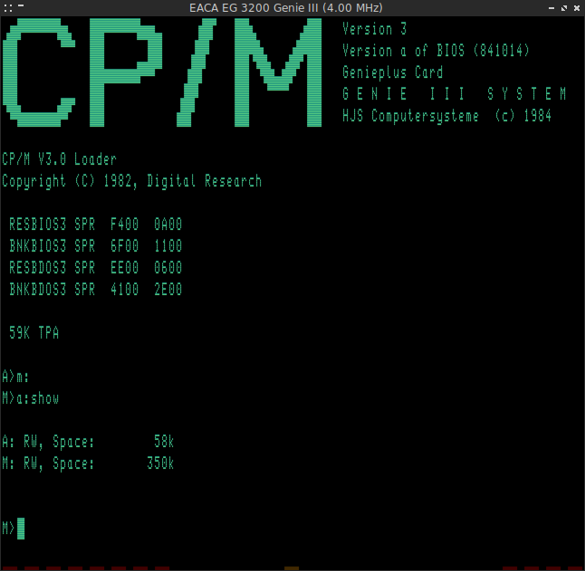

Updated version of Mark Grebe's [SDLTRS]:

  * Included all patches by [EtchedPixels]: banked memory support, Lowe LE18
  * Fixed various SegFaults: ROM Selection Menu, Scaling in Fullscreen
  * Reworked the TextGUI: new shortcuts and key bindings, help screen
  * Ctrl-A, Ctrl-C & Ctrl-V can now be used in the Emulator (CP/M & WordStar)
  * Display scanlines to simulate an old CRT monitor resolution
  * Access to real floppy disks works now on Linux
  * Tried to fix reported bugs to the original version
  * Port to SDL2 (see [BUILDING.md] and [SDL2])
  * Support Exatron Stringy Floppy for TRS-80 Model I
  * Select and execute CMD files directly in the Emulator
  * Save screenshot of the Emulator window as BMP file
  * Show Z80 registers in the window title bar
  * Adjust speed of Z80 CPU on the fly
  * Emulate Z80 memory refresh register
  * Support Holmes Sprinter II/III speed-up kits for TRS-80 Model I/III
  * Change Z80 CPU default MHz of each TRS-80 Model
  * More accurate emulation of Z80 block instructions
  * Joystick emulation with Mouse
  * Support Prologica CP-300/500 16kB ROM with extra 2kB Z80 monitor
  * Support Seatronics Super Speed-Up Board for all TRS-80 Models
  * Load and Save TRS-80 memory in debugger
  * Patch Model I ROM to boot from hard disk drive
  * Support EACA EG 3200 (Genie III) system
  * 480x192 HRG resolution for LNW80 and TCS SpeedMaster/Genie IIs
  * CP/M banking support for TRS-80 Model I clones
  * Support EG-64 Memory-Banking-Adaptor from TCS
  * Support Lubomir Soft Banker for TRS-80 Model I
  * Emulation of the TCS Genie IIIs system
  * Support EG 64.1 memory expansion for TRS-80 Model I
  * Support Schmidtke 80-Z Video Card for TRS-80 Model I
  * Emulate EG 3210 Programmable Graphics Adaptor for Genie III
  * Support some David Keil's TRS-80 Emulator extensions
  * Support Anitek MegaMem memory card for TRS-80 Model III and 4/4P
  * Emulate 4 MHz speedup hardware for TRS-80 Model III
  * Support TCS Genie IIs/SpeedMaster RAM 192 B memory expansion
  * Emulate 6845 CRTC Interlace Video Mode
  * Support VideoExtension HRG for EACA EG 3200 Genie III
  * Support Genieplus Memory Card for EACA EG 3200 Genie III

SDL(2)TRS is based on Tim Mann's excellent TRS-80 emulator [xtrs] and also
has very low system requirements: it works on all platforms supported by the
[SDL] library, even on machines with only a few hundred MHz of CPU speed.

Browse the [Documentation] online and checkout [SDLTRS and the Video Genies]
by Fritz Chwolka ...

## License

  [BSD 2-Clause](LICENSE)

## Contributing
All contributions are welcome.

## Binaries

  * [sdltrs.exe]     (32-bit, needs [SDL.DLL] of [SDL-1.2.14] for Win9X)
  * [sdl2trs.exe]    (32-bit, needs [SDL2.DLL])
  * [sdl2trs64.exe]  (64-bit, needs [SDL2.DLL])

(Release 1.2.24 build with [MinGW] & [MinGW-w64])

## Packages

  * [sdltrs_1.2.24-1_i386.deb]    (32-bit, SDL)
  * [sdl2trs_1.2.24-1_i386.deb]   (32-bit, SDL2)
  * [sdltrs_1.2.24-1_amd64.deb]   (64-bit, SDL)
  * [sdl2trs_1.2.24-1_amd64.deb]  (64-bit, SDL2)

(Build on Debian 9/i386 & Linux Mint 20.2/amd64)

Thanks to Tércio Martins a package for Arch Linux is available in the [AUR].

## SDL2

The [SDL2] branch contains the SDL2 version with hardware rendering support.
SDL2 binaries and packages above are build on the [SDL2] branch.

The SDL2 version is available in [RetroPie] since version 4.6.6 and Valerio
Lupi's fork of [RetroPie-Setup] ...

## Forks

  * [SDLTRS-SH] with Mongoose web server for debugging by Sascha Häberling
  * [SDLTRS-TRS-IO] with integrated TRS-IO and FreHD by Arno Puder

## Screenshots

[AUR]: https://aur.archlinux.org/packages/sdltrs
[BUILDING.md]: BUILDING.md
[Documentation]: https://jengun.gitlab.io/sdltrs
[EtchedPixels]: https://www.github.com/EtchedPixels/xtrs
[MinGW]: https://osdn.net/projects/mingw/
[MinGW-w64]: http://mingw-w64.org
[RetroPie]: https://github.com/RetroPie
[RetroPie-Setup]: https://github.com/valerino/RetroPie-Setup
[SDL]: https://www.libsdl.org
[SDL2]: https://gitlab.com/jengun/sdltrs/-/tree/sdl2
[SDL.DLL]: https://www.libsdl.org/download-1.2.php
[SDL2.DLL]: https://www.libsdl.org/download-2.0.php
[SDL-1.2.14]: https://www.libsdl.org/release/SDL-1.2.14-win32.zip
[SDLTRS]: http://sdltrs.sourceforge.net
[SDLTRS and the Video Genies]: http://www.myoldc.info/eaca_tcs_computer/sdltrs_and_the_videogenies.html
[SDLTRS-SH]: https://github.com/shaeberling/sdltrs
[SDLTRS-TRS-IO]: https://github.com/apuder/sdltrs-trs-io
[sdltrs.exe]: bin/sdltrs.exe
[sdl2trs.exe]: bin/sdl2trs.exe
[sdl2trs64.exe]: bin/sdl2trs64.exe
[sdltrs_1.2.24-1_i386.deb]: bin/sdltrs_1.2.24-1_i386.deb
[sdl2trs_1.2.24-1_i386.deb]: bin/sdl2trs_1.2.24-1_i386.deb
[sdltrs_1.2.24-1_amd64.deb]: bin/sdltrs_1.2.24-1_amd64.deb
[sdl2trs_1.2.24-1_amd64.deb]: bin/sdl2trs_1.2.24-1_amd64.deb
[xtrs]: https://www.tim-mann.org/xtrs.html
